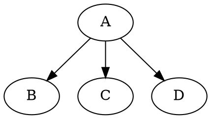

# graphene-graphql-chained-mutation
Testing a pattern to better chain GraphQL mutations using a Graphene-Python backend

I created this repo in order to test ideas after [a question on Stackoverflow](https://stackoverflow.com/questions/61340137/graphene-graphql-how-to-chain-mutations) and a [suggestion of a pattern](https://stackoverflow.com/a/61364567).

## Motivation

I have been thinking about this problem of chainin mutations and also the fact that it seems to be a recurring question among developers. I have come to conclude that may we miss something in the way we want to edit our graph, namely edge operations. I think we try to do edges operations with node operations. To illustrate this, a graph creation in a language like dot (Graphviz) may look like:



Following this pattern, maybe the graphql mutation in the question should look like:

```graphql
mutation {

    # Nodes

    n1: createUser(username: "new user", password: "secret"){
        uid
        username
    }

    n2: updateGroup(gid: "group id"){
        gid
        name
    }

    # Edges

    addUserToGroup(user: "n1", group: "n2"){
        status
    }
}
```

The inputs of the _"edge operation"_ `addUserToGroup` would be the aliases of the previous nodes in the mutation query.

This would also allow to decorate edge operations with permission checks (permissions to create a relation may differ from permissions on each object).

We can definitely resolve a query like this already. What is less sure is if backend frameworks, Graphene-python in particular, provide mechanisms to allow the implementation of `addUserToGroup` (having the previous mutation results in the resolution context). I'm thinking of injecting a `dict` of the previous results in the Graphene context. I'll try and complete the answer with technical details if successful.

Maybe there exist way to achieve something like this already, I will also look for that and complete the answer if found.
