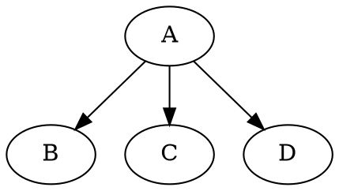

# graphene-graphql-chained-mutation
Testing a pattern to better chain GraphQL mutations using a Graphene-Python backend

I created this repo in order to test ideas after [a question on Stackoverflow](https://stackoverflow.com/questions/61340137/graphene-graphql-how-to-chain-mutations) and a [suggestion of a pattern](https://stackoverflow.com/a/61364567).

## Motivation

I have been thinking about this problem of chainin mutations and also the fact that it seems to be a recurring question among developers. I have come to conclude that may we miss something in the way we want to edit our graph, namely edge operations. I think we try to do edges operations with node operations. To illustrate this, a graph creation in a language like dot (Graphviz) may look like:



Following this pattern, maybe the graphql mutation in the question should look like:

```graphql
mutation {

    # Nodes

    n1: createUser(username: "new user", password: "secret"){
        uid
        username
    }

    n2: updateGroup(gid: "group id"){
        gid
        name
    }

    # Edges

    addUserToGroup(user: "n1", group: "n2"){
        status
    }
}
```

The inputs of the _"edge operation"_ `addUserToGroup` would be the aliases of the previous nodes in the mutation query.

This would also allow to decorate edge operations with permission checks (permissions to create a relation may differ from permissions on each object).

We can definitely resolve a query like this already. What is less sure is if backend frameworks, Graphene-python in particular, provide mechanisms to allow the implementation of `addUserToGroup` (having the previous mutation results in the resolution context). I'm thinking of injecting a `dict` of the previous results in the Graphene context. I'll try and complete the answer with technical details if successful.

Maybe there exist way to achieve something like this already, I will also look for that and complete the answer if found.

## Shared results middleware


In the file [shared_result_mutations.py](https://github.com/shinhermit/graphene-graphql-chained-mutation/blob/master/shared_results_mutation.py), I tested a way of resolving a query like above, using a [Graphene-python middleware](https://docs.graphene-python.org/en/latest/execution/middleware/) and a base mutation class to handle sharing the results.


The middleware is quite simple and adds a dict as `kwarg` parameter to the resolvers:

```python
class ShareResultMiddleware:

    shared_results = {}

    def resolve(self, next, root, info, **args):
        return next(root, info, shared_results=self.shared_results, **args)

```

The base class is also quite simple and manages the insertion of results in the dictionary:

```python
class SharedResultMutation(graphene.Mutation):

    @classmethod
    def mutate(cls, root: None, info: graphene.ResolveInfo, shared_results: dict, *args, **kwargs):
        result = cls.mutate_and_share_result(root, info, *args, **kwargs)
        if root is None:
            node = info.path[0]
            shared_results[node] = result
        return result

    @staticmethod
    def mutate_and_share_result(*_, **__):
        return SharedResultMutation()  # override
```

A node-like mutation that need to comply with the shared result pattern would inherit from `SharedResultMutation` in stead of `Mutation` and override `mutate_and_share_result` instead of `mutate`:

```python
class UpsertParent(SharedResultMutation, ParentType):
    class Arguments:
        data = ParentInput()

    @staticmethod
    def mutate_and_share_result(root: None, info: graphene.ResolveInfo, data: ParentInput, *___, **____):
        return UpsertParent(id=1, name="test")
```

The edge-like mutations need to access the `shared_results` dict, so they override `mutate` directly:

```python
class AddSibling(SharedResultMutation):
    class Arguments:
        node1 = graphene.String(required=True)
        node2 = graphene.String(required=True)

    ok = graphene.Boolean()

    @staticmethod
    def mutate(root: None, info: graphene.ResolveInfo, shared_results: dict, node1: str, node2: str):  # ISSUE: this breaks type awareness
        node1_ : ChildType = shared_results.get(node1)
        node2_ : ChildType = shared_results.get(node2)
        assert node1_ is not None
        assert node2_ is not None
        FakeChildDB[node1_.pk].siblings.append(node2_.pk)
        FakeChildDB[node2_.pk].siblings.append(node1_.pk)
        return AddSibling(ok=True)
```

And that's basically it (the rest is common Graphene boilerplate and test mocks).

The issue with this is that the edge-like mutation arguments do not satisfy the _type awareness_ that GraphQL promotes: in the GraphQL spirit, `node1` and `node2` should be typed `graphene.Field(ChildType)`, instead of `graphene.String()` as in this implementation.

